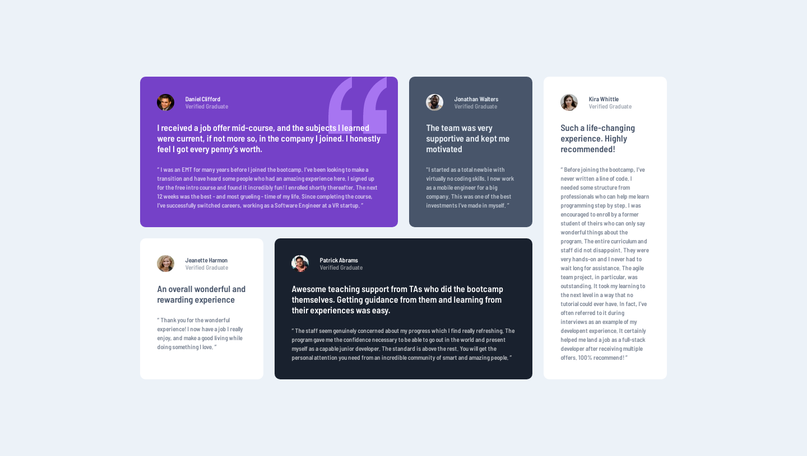

# Frontend Mentor - Testimonials grid section solution

This is a solution to the [Testimonials grid section challenge on Frontend Mentor](https://www.frontendmentor.io/challenges/testimonials-grid-section-Nnw6J7Un7). Frontend Mentor challenges help you improve your coding skills by building realistic projects. 

## Table of contents

  - [The challenge](#the-challenge)
  - [Screenshot](#screenshot)
  - [Built with](#built-with)
  - [What I learned](#what-i-learned)
- [Author](#author)

### The challenge

Users should be able to:

- View the optimal layout for the site depending on their device's screen size

### Screenshot



Add a screenshot of your solution. The easiest way to do this is to use Firefox to view your project, right-click the page and select "Take a Screenshot". You can choose either a full-height screenshot or a cropped one based on how long the page is. If it's very long, it might be best to crop it.

Alternatively, you can use a tool like [FireShot](https://getfireshot.com/) to take the screenshot. FireShot has a free option, so you don't need to purchase it. 

Then crop/optimize/edit your image however you like, add it to your project, and update the file path in the image above.

### Built with

- Semantic HTML5 markup
- CSS custom properties
- CSS Grid
- Mobile-first workflow

### What I learned

This challenge was very fun and rewarding as it helped me sharpen my knowledge on how the css grid system works.

```css
    .card_1{
        grid-area: auto / span 2;
    }
```

## Author

- Frontend Mentor - [@mikester380](https://www.frontendmentor.io/profile/mikester380)
- Twitter - [@boyyarome](https://www.twitter.com/boyyarome)
